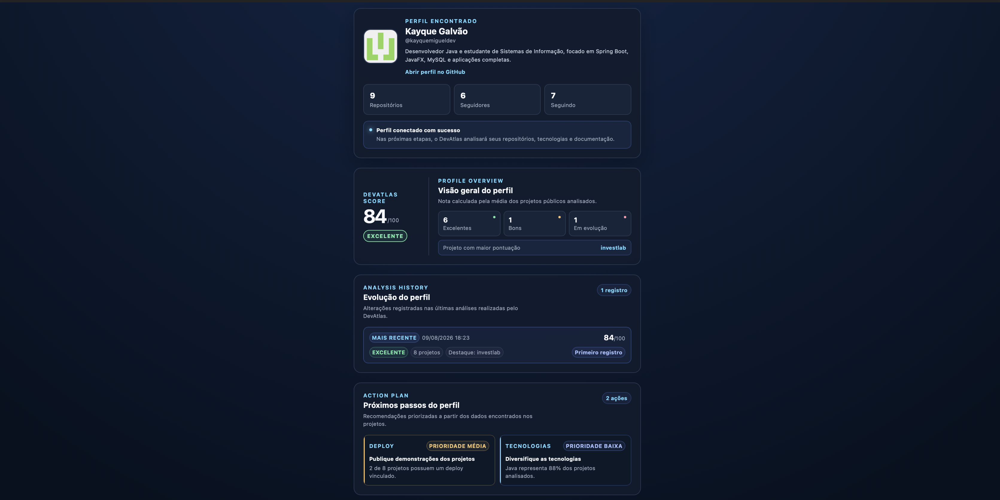
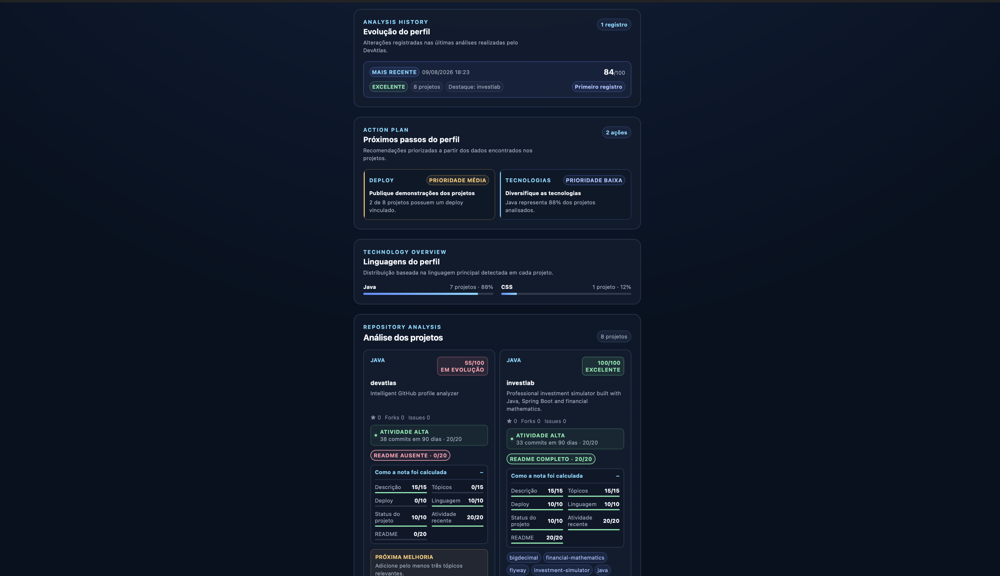
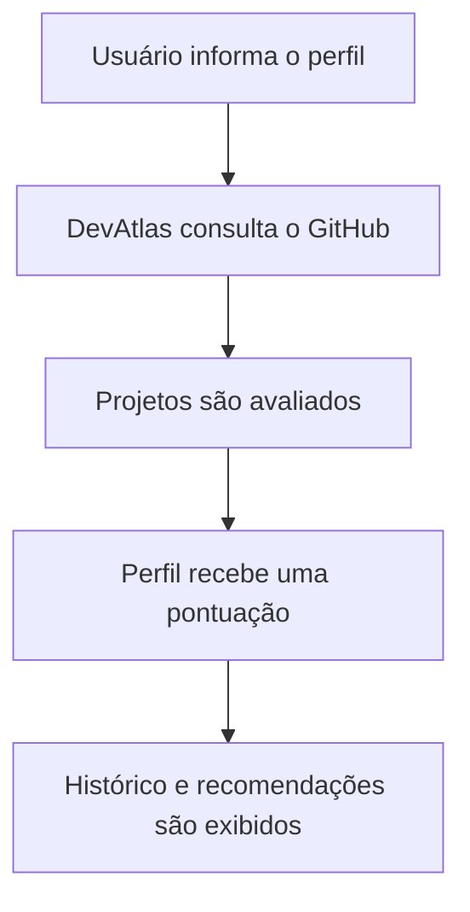

<div align="center">

#  DevAtlas

### Analisador inteligente de perfis e projetos públicos do GitHub.

Pontuação de projetos • Análise de README • Atividade recente • Recomendações personalizadas

<br>

[](https://www.oracle.com/java/)
[](https://spring.io/projects/spring-boot)
[](https://www.thymeleaf.org/)
[](https://www.postgresql.org/)
[](https://maven.apache.org/)
[](https://documentation.red-gate.com/flyway)
[](https://www.docker.com/)
[](#testes)

</div>

---

## Sobre o projeto

O **DevAtlas** é uma aplicação web que analisa perfis públicos do GitHub e transforma os dados encontrados em uma visão clara da qualidade dos projetos de um desenvolvedor.

A aplicação avalia documentação, atividade recente, tecnologias, organização dos repositórios e disponibilidade de deploy. A partir desses dados, calcula pontuações, registra a evolução do perfil e apresenta recomendações de melhoria.

O projeto foi desenvolvido para ir além de uma simples consulta à API. Seu núcleo reúne regras de negócio, integração com serviços externos, persistência, cache, segurança e análise automatizada de repositórios.

---

## Visão geral

A primeira parte da análise apresenta as informações do desenvolvedor, a pontuação geral, o histórico e as recomendações priorizadas.



---

## Análise dos projetos

A segunda parte apresenta a distribuição das tecnologias e o detalhamento individual de cada repositório analisado.



---

## Funcionalidades

- busca de usuários públicos do GitHub;
- análise dos repositórios próprios do perfil;
- exclusão de forks e do repositório especial do usuário;
- pontuação individual dos projetos;
- análise da qualidade do README;
- análise de commits realizados nos últimos 90 dias;
- distribuição das linguagens utilizadas;
- recomendações priorizadas de melhoria;
- histórico de evolução do perfil;
- cache das consultas à API do GitHub;
- limitação de requisições por endereço IP;
- tratamento de usuários inexistentes e indisponibilidade da API;
- endpoints de monitoramento da aplicação.

## Sistema de pontuação

Cada projeto pode alcançar até 100 pontos:

| Critério | Pontuação máxima |
| --- | ---: |
| Descrição | 15 |
| Tópicos | 15 |
| Deploy publicado | 10 |
| Linguagem identificada | 10 |
| Estado do projeto | 10 |
| Atividade recente | 20 |
| README | 20 |
| **Total** | **100** |

A média dos projetos analisados forma a pontuação geral do perfil.

## Fluxo da análise



A aplicação separa as responsabilidades entre controllers, serviços de análise, cliente da API do GitHub e camada de persistência.

## Tecnologias

- Java 21;
- Spring Boot 4.1;
- Spring MVC e Thymeleaf;
- Spring Data JPA;
- Maven;
- H2 para execução local;
- PostgreSQL para produção;
- Flyway para migrations;
- Caffeine Cache;
- Bucket4j;
- Spring Boot Actuator;
- JUnit 5 e Mockito;
- Docker;
- GitHub Actions;
- CodeQL e Dependabot.

## Segurança e confiabilidade

O DevAtlas possui:

- validação de nomes de usuário do GitHub;
- limite de análises por endereço IP;
- limite máximo de 25 repositórios por análise;
- timeouts nas chamadas externas;
- tratamento do limite de requisições da API do GitHub;
- headers de segurança e Content Security Policy;
- execução do container com usuário sem privilégios;
- verificação automatizada com CodeQL, Dependabot e Secret Scanning.

Vulnerabilidades devem ser comunicadas de forma privada conforme a [Política de Segurança](.github/SECURITY.md).

## Persistência

O histórico é salvo somente quando a pontuação ou os dados relevantes do perfil mudam.

Por padrão, o ambiente local utiliza um banco H2 armazenado em:

```text
data/devatlas.mv.db
```

Em produção, a aplicação pode utilizar PostgreSQL por meio das variáveis de ambiente.

## Executando localmente

### Requisitos

- Java 21 ou superior;
- Git;
- acesso à internet.

Clone o projeto:

```bash
git clone https://github.com/kayquemigueldev/devatlas.git
cd devatlas
```

Execute os testes:

```bash
./mvnw clean test
```

Inicie a aplicação:

```bash
./mvnw spring-boot:run
```

Acesse:

```text
http://localhost:8080
```

## Token do GitHub

O token é opcional, mas recomendado para aumentar o limite de consultas à API.

No macOS ou Linux:

```bash
read -s GITHUB_TOKEN
export GITHUB_TOKEN
./mvnw spring-boot:run
```

O token deve possuir apenas permissões de leitura. Nunca salve tokens no código, no `application.properties` ou no Git.

## Variáveis de ambiente

| Variável | Obrigatória | Descrição |
| --- | --- | --- |
| `GITHUB_TOKEN` | Não | Token de leitura da API do GitHub |
| `DB_URL` | Não | URL JDBC do banco de dados |
| `DB_USERNAME` | Não | Usuário do banco |
| `DB_PASSWORD` | Não | Senha do banco |
| `PORT` | Não | Porta HTTP, com padrão `8080` |

Sem variáveis de banco, a aplicação utiliza o H2 local automaticamente.

## Executando com Docker

Construa a imagem:

```bash
docker build -t devatlas:local .
```

Execute o container:

```bash
docker run --rm \
  --name devatlas \
  -p 8080:8080 \
  -e GITHUB_TOKEN="$GITHUB_TOKEN" \
  devatlas:local
```

Depois, acesse:

```text
http://localhost:8080
```

## Monitoramento

A aplicação disponibiliza os seguintes endpoints:

```text
GET /actuator/health
GET /actuator/info
```

Exemplo:

```bash
curl http://localhost:8080/actuator/health
```

## Integração contínua

O GitHub Actions executa os testes automaticamente em pushes e pull requests direcionados à branch `main`.

O projeto também utiliza:

- Dependabot para acompanhar atualizações;
- CodeQL para análise estática de segurança;
- Secret Scanning para detectar credenciais expostas;
- ruleset para impedir exclusão e force push na branch principal.

## Limitações atuais

- somente repositórios públicos são analisados;
- no máximo 25 projetos são processados por análise;
- a distribuição tecnológica considera a linguagem principal de cada repositório;
- os resultados dependem dos dados disponibilizados pela API do GitHub;
- a análise não substitui uma avaliação manual completa do código.

## Autor

Desenvolvido por [Kayque Miguel](https://github.com/kayquemigueldev).

Projeto criado para aprofundar conhecimentos em Java, Spring Boot, integração com APIs, persistência, testes, segurança e containerização.